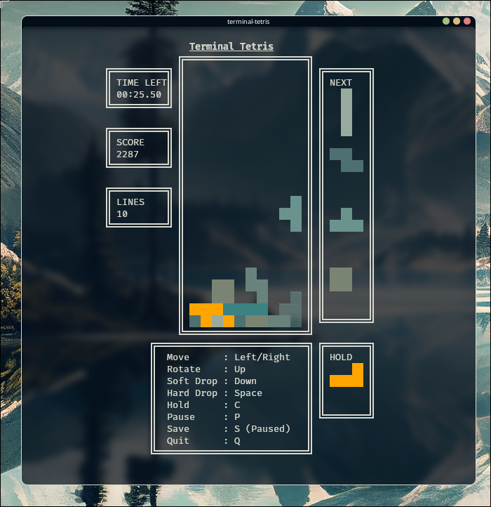
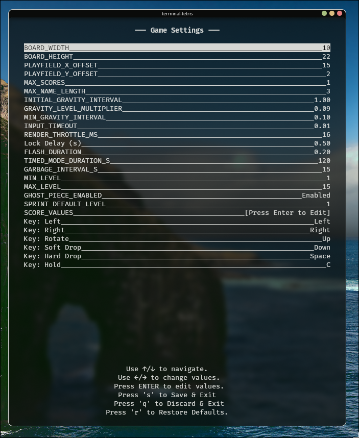
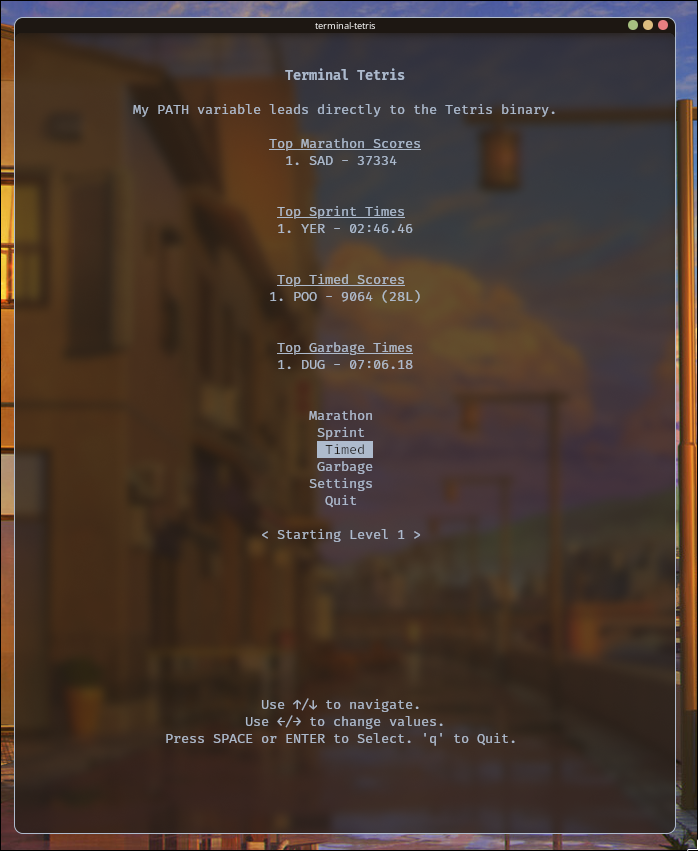

# Terminal Tetris

This is a terminal-based Tetris game written in Python. It aims to be a feature-rich implementation of the classic game with modern mechanics. This project was created for personal use.
 
-----

## Features

  * **Classic Tetris Gameplay**: A fully-featured Tetris implementation for the terminal.
  * **Modern Mechanics**: Includes advanced mechanics like T-Spin detection and a back-to-back bonus system.
  * **Hold Functionality**: Swap out the current piece with a stored piece.
  * **Persistent Database**: All high scores and user settings are saved to a local tetris.db file, so your progress and customizations are always remembered.
  * **Settings Menu**: Customize everything from keybindings to game physics and scoring values.
  * **Ghost Piece**: A preview of where the current piece will land.
  * **High Score Tracking**: The top 5 scores are saved and displayed on the main menu.
  * **Level Progression**: The game's speed increases as you clear more lines.
  * **Proper Lock Delay**: A half-second delay after a piece touches a surface, allowing for last-second adjustments.
  * **Bag Randomization**: A 7-bag randomization system ensures that all seven tetrominoes will appear in a random order before any are repeated.

-----

## How to Play

### Installation

1.  Clone the repository:
    ```bash
    git clone https://github.com/averyvisentin/terminal-tetris.git
    ```
2.  Navigate to the project directory:
    ```bash
    cd terminal-tetris
    ```
3.  Install the required `blessed` library: #I'm using the arch package python-blessed.
    ```bash
    pip install -r requirements.txt
    ```
https://github.com/jquast/blessed

https://pypi.org/project/blessed/


### Running the Game

You can run the game using the following command:

```bash
python terminal-tetris.py
```

A shell script is also provided for convenience:

```bash
./launch.sh
```

-----

## Controls

| Key         | Action        |
| :---------- | :------------ |
| `←` / `→`   | Move          |
| `↑`         | Rotate        |
| `↓`         | Soft Drop     |
| `Space`     | Hard Drop     |
| `c`         | Hold          |
| `p`         | Pause         |
| `q`         | Quit          |

-----

## Scoring

The scoring system is based on modern Tetris guidelines, with the base score multiplied by the current level.

| Action              | Score     |
| :------------------ | :-------- |
| Single              | 100       |
| Double              | 300       |
| Triple              | 500       |
| Tetris              | 800       |
| T-Spin Mini         | 100       |
| T-Spin              | 400       |
| T-Spin Single       | 800       |
| T-Spin Double       | 1200      |
| T-Spin Triple       | 1600      |
| Back-to-Back Bonus  | 1.5x      |

-----

## High Scores

The game keeps track of the top 5 high scores in a `tetris.db` file. If you achieve a high score, you will be prompted to enter a three-character name.


